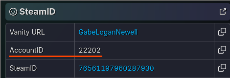

Usage
=====

<!-- TOC -->
* [Usage](#usage)
  * [System requirements](#system-requirements)
  * [Running server](#running-server)
    * [Server options](#server-options)
  * [Connecting to server](#connecting-to-server)
    * [1. Backup your save](#1-backup-your-save)
    * [2. Download the executable](#2-download-the-executable)
    * [3. Run](#3-run)
    * [4. Provide custom server url (optional)](#4-provide-custom-server-url-optional)
  * [Advanced usage](#advanced-usage)
  * [Contributing](#contributing)
<!-- TOC -->

## System requirements

  - OS:
      - Windows 10, 64bit
      - Linux >=3.2, 64bit
  - some space on disk
  - a little bit of RAM

## Running server

```shell
./fuse-linux-amd64 -standalone
```


> [!CAUTION]
> Neither authorization nor authentication are implemented. Anyone can send anything; that data will be accepted 
> without errors.

### Server options

```shell
Usage of ./fuse-linux-amd64:
  -baseURL string
        base url (default "http://127.0.0.1:6667/")
  -listenAddr string
        listen addr (default "127.0.0.1:6667")
  -passThrough
        work as a proxy between client and original master server
  -platform string
        server platform (default "tppstm")
  -standalone
        standalone mode (do not attempt to patch and backup executable)
  -writeLog
        save requests and responses to files
```

If server is used in standalone mode (ex. over the internet), base url must be set to server external address or hostname.

`writeLog` option creates `log` directory and writes all requests and responses in files there, which is 
handy with `passThrough` mode.

## Connecting to server

> [!WARNING]
> Uploading wildly different save data (like soldiers farmed on another server or billions of heroism) *may* result in 
> online ban on original master server. You are strongly recommended to back up your save.

### 1. Backup your save

Make a copy of following directories:

**Windows**:


```shell
C:\Program Files (x86)\Steam\userdata\<AccountID>\287700
C:\Program Files (x86)\Steam\userdata\<AccountID>\311340
```

Follow [this guide](https://steamcommunity.com/discussions/forum/1/3175526477771610741/) if you cannot find your userdata.

**Linux**:

```shell
~/.local/share/Steam/userdata/<AccountID>/287700
~/.local/share/Steam/userdata/<AccountID>/311340
```

If you have different accounts, get your AccountID here - https://steamdb.info/calculator/




### 2. Download the executable

Latest release: https://github.com/unknown321/fuse/releases/latest

Open directory with `mgsvtpp.exe` (Steam -> Right click on MGSV:TPP -> Properties -> Installed files -> Browse). Put fuse 
executable in that directory.

### 3. Run

Run fuse executable. It will:
  - automatically create a backup of `mgsvtpp.exe`
  - patch `mgsvtpp.exe` with local server address (`http://127.0.0.1:6667`)
  - start server at `http://127.0.0.1:6667`

### 4. Provide custom server url (optional)

Create file named `fuse.txt` with custom server url, then launch the executable. It will:
  - automatically create a backup of `mgsvtpp.exe`
  - patch `mgsvtpp.exe` with custom server address (contents of `fuse.txt`)

## Advanced usage

[Advanced usage](./ADVANCED.md)

## Contributing

[Contributing](./CONTRIBUTING.md)